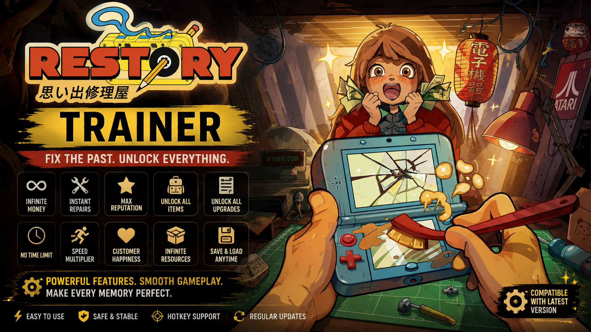
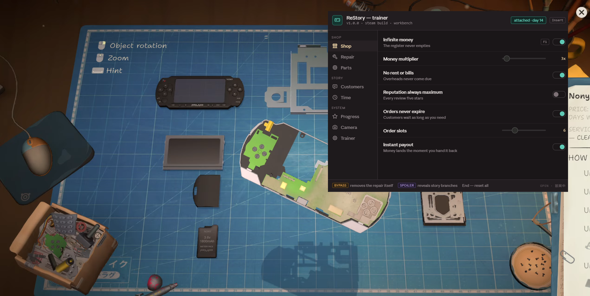

# ReStory Trainer — Mod Menu & Cheats for Chill Electronics Repairs (v1.0.0)

**ReStory: Chill Electronics Repairs trainer** with an in-game **mod menu** built for a shop sim: infinite money, infinite spare parts, instant delivery, no rent, unlock all devices and shop upgrades, freeze the clock, free camera. Works with the **Steam** release of Mandragora and tinyBuild's mid-2000s Tokyo repair shop game. Open the overlay with `Insert`, flip a toggle, get back to the workbench.

> **[⬇ Download the latest ReStory trainer](https://github.com/daimyodoctorlearn/restory-trainer/releases/latest)**

    

---

## Contents

- [What this is](#what-this-is)
- [Bypass and spoiler tags](#bypass-and-spoiler-tags)
- [Compatibility](#compatibility)
- [Features](#features)
  - [Shop](#shop--money-and-orders) · [Repair](#repair--the-workbench) · [Parts](#parts--inventory-and-tools) · [Customers](#customers--dialogue-and-story) · [Time](#time--the-day-cycle) · [Progress](#progress--unlocks) · [Camera](#camera--photo-mode-options) · [Trainer](#trainer-options)
- [Hotkeys](#hotkeys)
- [Installation](#installation)
- [How to use the mod menu](#how-to-use-the-mod-menu)
- [Troubleshooting](#troubleshooting)
- [FAQ](#faq)
- [Changelog](#changelog)
- [Disclaimer](#disclaimer)

---

## What this is

*ReStory* is a quiet game about a small electronics repair shop in mid-2000s Tokyo. Somebody walks in with a dead handheld, a scratched camera, a phone that meant something to them. You take it apart, clean it, work out what's actually wrong, source the part off a period-accurate web catalogue, put it back together, and hand it back. Along the way you hear their story, and what you say to them branches the game toward one of several endings.

A trainer for this is a strange object, and it's worth being honest about why. In a game where the repair *is* the content, an option that auto-cleans and auto-diagnoses doesn't make the game easier — it makes the game not happen.

So this trainer is organised around that distinction. Most of what's here removes **friction**: waiting three in-game days for a capacitor to ship, scraping together rent money, running out of shelf space. That's the stuff that gets in the way of the part you came for. A smaller set of options removes the **repair loop itself**, and those are tagged so you know what you're switching off.

---

## Bypass and spoiler tags

Two tags appear next to option names in the menu.

**`bypass`** — this option skips the hands-on repair. Instant disassembly, auto-clean, instant reassembly, and diagnosis revealing every fault. Turn these on and the workbench becomes a button. They're all off by default, and they exist mainly for people replaying to see a different ending, or doing a hundredth device they've already mastered.

**`spoiler`** — this option shows you story content ahead of time. Reveal dialogue outcomes, unlock all dialogue options, unlock the ending gallery. ReStory's branching is the reason to play it twice; seeing the map before you walk it takes that away. Also off by default.

Everything without a tag is quality-of-life. Infinite money, instant shipping, no rent, unlimited storage, no tool wear — none of it touches the actual repairing.

---

## Compatibility

| | |
|---|---|
| **Game** | ReStory: Chill Electronics Repairs (Mandragora / tinyBuild, released 6 August 2026) |
| **Store** | Steam |
| **OS** | Windows 10 and Windows 11, 64-bit |
| **Runtime** | .NET Desktop Runtime 8 or newer, DirectX 11 |
| **macOS** | Not supported — the Mac build would need a separate implementation |
| **Demo build** | Not supported, the demo runs on a separate app ID |
| **Steam Deck / Proton** | Not supported |

The game itself is light — a GTX 750 Ti, 4 GB of RAM and about 4 GB of disk. The trainer adds essentially nothing to that.

---

## Features

    

55+ options across eight tabs, grouped into **Shop**, **Story** and **System**. Sliders show the shipped default.

### Shop — money and orders

| Option | What it does | Hotkey |
|---|---|---|
| **Infinite money** | The register never empties | `F1` |
| **Money multiplier** | `1x`–`50x`, default `3x` | — |
| **No rent or bills** | Overheads never come due | — |
| **Reputation always maximum** | Every review five stars | — |
| **Orders never expire** | Customers wait as long as you need | — |
| **Order slots** | `1`–`20`, default `6` | — |
| **Instant payout** | Money lands the moment you hand it back | — |

**Orders never expire** is the quiet favourite here. The game's pressure comes from the queue, and taking that off lets you spend forty minutes on one device without a timer nagging you — which is closer to what the game is selling itself as anyway.

### Repair — the workbench

| Option | What it does | Hotkey | Tag |
|---|---|---|---|
| **Instant disassembly** | Every screw out at once | `F2` | bypass |
| **Auto-clean** | Dirt, rust and residue gone in one pass | `F3` | bypass |
| **Cleaning always perfect** | 100% on every surface | — | — |
| **Screws never strip** | No stripped heads, no seized threads | — | — |
| **Parts survive removal** | Ribbon cables live through your hands | — | — |
| **Instant reassembly** | The device closes itself | `F8` | bypass |
| **Repair quality** | `1%`–`100%`, default `100%` | — | — |
| **Diagnosis reveals every fault** | Skip the fault-finding entirely | — | bypass |

Note the difference between the tagged and untagged options here. **Screws never strip** and **Parts survive removal** remove punishment for a slip — you still do the work. **Instant disassembly** does the work for you. Same tab, completely different effect on your evening.

### Parts — inventory and tools

| Option | What it does | Hotkey |
|---|---|---|
| **Infinite spare parts** | Every part, always in the drawer | `F4` |
| **All parts in stock online** | The whole catalogue, always listed | — |
| **Instant delivery** | No shipping wait | — |
| **Free shipping** | — | — |
| **Parts always mint** | No worn or salvaged condition | — |
| **Unlimited storage** | Shelves never fill up | — |
| **Unlock all tools** | Every tool from day one | — |
| **No tool wear** | — | — |

**Instant delivery** is the single most-used option in this trainer and the least destructive. Waiting on shipping is the one bit of friction that doesn't teach you anything.

### Customers — dialogue and story

| Option | What it does | Hotkey | Tag |
|---|---|---|---|
| **Customers always satisfied** | Nobody leaves unhappy | `F5` | — |
| **Reveal dialogue outcomes** | See where each choice leads | — | spoiler |
| **Unlock all dialogue options** | Every line, regardless of standing | — | spoiler |
| **No conversation timer** | Take as long as you like to answer | — | — |
| **Relationship multiplier** | `1x`–`20x`, default `2x` | — | — |
| **Skip dialogue** | — | — | — |
| **Customer patience** | `1`–`10`, default `10` | — | — |

**No conversation timer** deserves a mention on its own. Timed dialogue in a game this gentle is a friction a lot of people don't want, especially if they're reading in a second language. It doesn't reveal anything or change any outcome — it just stops the clock while you decide.

### Time — the day cycle

| Option | What it does | Hotkey |
|---|---|---|
| **Freeze the clock** | The day stops where it stands | `F6` |
| **Day length** | `1x`–`10x`, default `1x` | — |
| **Skip to next day** | — | `F7` |
| **Game speed** | `0.1x`–`5.0x`, default `1.0x` | — |
| **Shop always open** | No closing hours | — |
| **Time of day** | Any hour, default `19:00` | — |

Set the time to `19:00` and freeze it, and the shop sits in evening light indefinitely. Most of the screenshots people post of this game are taken at that hour.

### Progress — unlocks

| Option | What it does | Tag |
|---|---|---|
| **Unlock all devices** | Every console, handheld, phone and camera | — |
| **Unlock all shop upgrades** | — | — |
| **Unlock all decorations** | — | — |
| **Shop level** | `1`–`50`, default `12` | — |
| **Unlock the ending gallery** | Every branch, viewable at once | spoiler |
| **Experience multiplier** | `1x`–`50x`, default `5x` | — |
| **Unlock all customers** | — | — |

Everything in this tab writes persistent data. Back up your save first.

### Camera & photo mode options

| Option | What it does | Hotkey |
|---|---|---|
| **Field of view** | `60`–`110 deg`, default `75 deg` | — |
| **Free camera** | Step out from behind the counter | `F9` |
| **Hide interface** | Drop the HUD and all prompts | `F10` |
| **Device zoom range** | Get closer to the board than the game allows — `1x`–`10x`, default `3x` | — |
| **Disable depth of field** | — | — |
| **Disable grain and bloom** | — | — |
| **Extended photo mode** | Filters, angles, timescale | — |

**Device zoom range** is the one worth having if you care about the hardware. The devices are modelled in real detail — board traces, solder joints, moulding seams — and the default camera doesn't let you get close enough to appreciate it.

### Trainer options

| Option | What it does |
|---|---|
| **Hotkeys** | Global bindings on or off |
| **Menu key** | Rebind the overlay — `Insert`, `F1`, `Home`, `~` |
| **Overlay opacity** | `40%`–`100%`, default `92%` |
| **Block achievement unlocks** | Keep a cheated run off your profile |
| **Read-only mode** | Show values, write nothing |
| **Back up saves before writing** | Copy the save folder on first attach |
| **Reset all at day end** | Turn everything off when the shop closes |
| **Auto-load profile** | Apply the saved set on launch |

---

## Hotkeys

| Key | Action |
|---|---|
| `Insert` | Open or close the mod menu |
| `F1` | Infinite money |
| `F2` | Instant disassembly |
| `F3` | Auto-clean |
| `F4` | Infinite spare parts |
| `F5` | Customers always satisfied |
| `F6` | Freeze the clock |
| `F7` | Skip to next day |
| `F8` | Instant reassembly |
| `F9` | Free camera |
| `F10` | Hide interface |
| `End` | Reset every option |
| `↑ ↓ ← → Enter` | Navigate the menu without a mouse |

---

## Installation

1. **Download** the latest archive from the [Releases page](https://github.com/daimyodoctorlearn/restory-trainer/releases/latest).
2. **Unblock it** — right-click the `.zip`, choose Properties, tick *Unblock*, then Apply. Windows quarantines downloaded archives and the trainer won't attach otherwise.
3. **Extract** anywhere outside `Program Files`.
4. **Launch the game first** and load your shop, so the process exists.
5. **Run the trainer as administrator.** The header should read `attached` with your current day.
6. **Press `Insert`.**

Back up your save before the first run. Save data typically sits under `%USERPROFILE%\AppData\LocalLow` in the developer's folder — check your install for the exact path, since it can differ between builds. Turn off Steam Cloud for the game while you experiment so a bad local write doesn't sync upward.

---

## How to use the mod menu

Pick a tab on the left, flip what you need on the right. Sliders update live.

A few setups worth knowing:

- **Friction only, repairs untouched:** `Instant delivery` + `Free shipping` + `No rent or bills` + `Orders never expire`. Nothing tagged, nothing skipped. You still do every repair by hand, you just stop waiting and stop worrying about money.
- **Second playthrough for a different ending:** `Instant disassembly` + `Auto-clean` + `Instant reassembly`. You've done the repairs; now you want the story.
- **Reading at your own pace:** `No conversation timer` + `Customer patience 10` + `Freeze the clock`.
- **Looking at the hardware:** `Device zoom range 10x` + `Disable depth of field` + `Hide interface`.
- **Evening shop screenshots:** `Time of day 19:00` + `Freeze the clock` + `Free camera` + `Hide interface`.

---

## Troubleshooting

**Trainer says the process wasn't found.** The game has to be running with a shop loaded. Launch ReStory, load your save, then start the trainer.

**Nothing happens when I press Insert.** Another overlay is eating the key. Steam's overlay, Discord and RTSS are the usual suspects. Rebind under **Trainer → Menu key**.

**Repair options do nothing from the shop floor.** Workbench memory is allocated when you put a device on the bench. Start a repair first, then toggle.

**A device got stuck half-assembled.** Turn off any `bypass` option, take the device off the bench and put it back on. If it's still stuck, reload the day.

**My unlocks disappeared after an update.** The developers shipped a patch within days of launch and more are coming. Progress-tab options write persistent data that a patch can invalidate. Restore the backup the trainer made on first attach.

**Windows Defender flagged it.** Trainers read and write another process's memory, which is what a lot of malware also does, so heuristic scanners flag them on principle. Add an exclusion if you're comfortable with that — and if you'd rather not, don't. That's a reasonable call.

**I only have the demo.** The demo is a separate app ID and isn't supported.

---

## FAQ

### Will I get banned for using cheats in ReStory?

It's a single-player game with no anti-cheat and no multiplayer, so there's nothing to be banned from. Achievements unlock locally unless you turn on the block in the Trainer tab.

### Does the trainer spoil the story?

Only if you turn on a `spoiler`-tagged option, and all three are off by default. Reveal dialogue outcomes, unlock all dialogue options and unlock the ending gallery all show you story content early. Everything else leaves the narrative exactly as written.

### Can I get infinite money in ReStory?

Yes, in the Shop tab, along with a money multiplier, no rent or bills, and instant payout.

### Does it skip the repair minigame?

It can, but those options are tagged `bypass` and are off by default. Instant disassembly, auto-clean, instant reassembly and full diagnosis all remove the hands-on part. Most people leave them off for a first playthrough and turn them on for a second.

### How do I get parts faster?

**Instant delivery** and **All parts in stock online** in the Parts tab. Or **Infinite spare parts** if you'd rather skip the catalogue entirely.

### Can I zoom in further on the devices?

Yes — **Device zoom range** in the Camera tab goes up to 10x past the game's own limit. Worth it for the modelling.

### Does it work on Mac?

No. Windows only.

### Does it work on Steam Deck or Linux?

No. Proton changes how the game's memory is laid out.

### Will it corrupt my save?

The Progress tab writes persistent data — devices, upgrades, decorations, shop level. That's why the trainer backs up on first attach and why it's worth turning off Steam Cloud while you experiment. Everything else is runtime-only.

### How do I turn everything off?

Press `End`.

---

## Changelog

### v1.0.0 — 11 August 2026

First public release. 55+ options across Shop, Repair, Parts, Customers, Time, Progress, Camera and Trainer. Bypass and spoiler tagging from the start, so you can strip the friction without stripping the game.

Full history on the [Releases page](https://github.com/daimyodoctorlearn/restory-trainer/releases).

---

## Contributing

Bug reports welcome — open an [issue](https://github.com/daimyodoctorlearn/restory-trainer/issues) with your game build number, Windows version, which device you were repairing, and which option misbehaved. The developers are patching frequently after launch, so the build number matters.

---

## Disclaimer

Unofficial fan tool. **Not affiliated with, endorsed by, or connected to Mandragora, tinyBuild, Atari or Valve.** *ReStory: Chill Electronics Repairs* and all related names and assets belong to their respective owners.

Intended for single-player use on your own copy. Modifying a running game's memory carries some risk of crashes and save corruption — back up your save, and use it at your own risk.

Released under the [MIT License](LICENSE).

---

ReStory trainer · ReStory Chill Electronics Repairs cheats · ReStory mod menu for PC · infinite money, infinite spare parts, instant delivery, no rent, unlock all devices and upgrades, freeze the clock, free camera · Steam · Mandragora and tinyBuild · mid-2000s Tokyo repair shop simulator
